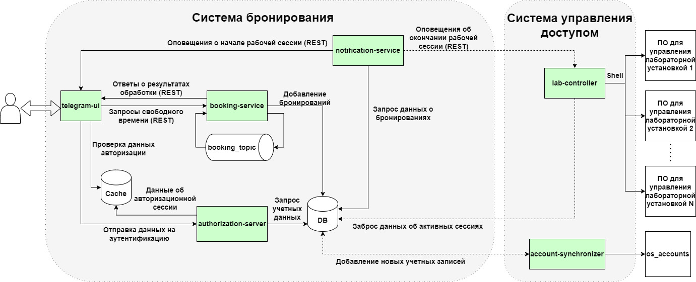
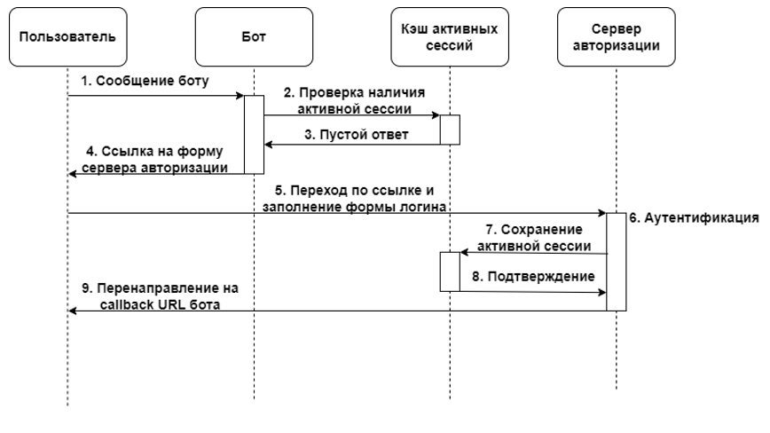

## Lab Booking Manager

Универсальная распределенная система бронирования и контроля доступа к дистанционным лабораторным установкам (ДЛУ).

### Общая архитектурная схема

Подсистема управления доступом устанавливается непосредственно на сервер с программным обеспечением ДЛУ 
и может иметь несколько экземпляров в отличие от подсистемы бронирования. 

#### Система управления доступом

Основным компонентом системы управления доступом является контроллер ПО лабораторных установок, который реализует 
механизм контроля доступа на уровне операционной системы сервера. Суть данного механизма сводится к периодическому 
сопоставлению информации о бронированиях из базы данных и запущенных программ, управляющих лабораторными установками. 
Если пользователь, запустивший программу не имеет на данный момент активного бронирования в системе, то выполнение 
программы будет принудительно завершено. Также контроллер с помощью периодической проверки базы данных открывает и 
закрывает доступ на запуск программ управления для конкретного пользователя согласно имеющимся активным бронированиям. 
Все описанные действия производятся посредством исполнения команд операционной системы. Синхронизатор аккаунтов позволяет 
актуализировать данные пользователей из операционной системы в базе данных системы бронирования.

#### Система бронирования

Взаимодействие с пользователем осуществляется с помощью телеграм бота системы бронирования. Предоставление доступа 
к основным функциям бота происходит с помощью сервера авторизации с использованием кастомного механизма авторизации. 
Авторизованный пользователь с помощью бота может получать информацию о списке доступных установок 
и времени для бронирования, которые запрашиваются у сервиса бронирования. Основная операция – это создание нового 
бронирования выполняется асинхронно с использованием очереди сообщений в сервисе бронирований. Сервис уведомлений 
периодически проверяет состояние базы данных и формирует информацию для уведомлений о начале или об окончании 
работы за установкой.

### Механизм авторизации

Для реализации системы бронирования был разработан специальный механизм авторизации в чат ботах.

